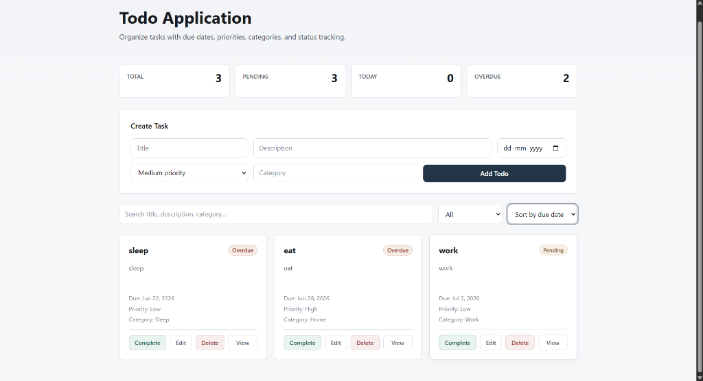

# 📋 TaskFlow - Full-Stack Task Management Application

A feature-packed, production-ready full-stack Task Management application built with **React**, **Node.js**, **Express**, **MongoDB**, and a custom **Semantic CSS Design System**.


## 📸 Application Preview



---

## 🔥 Comprehensive Features List

### 📝 **1. Complete Task CRUD Operations**
- **Create Tasks**: Add new tasks with title, description, due date, priority levels (`low`, `medium`, `high`), and categories.
- **View Tasks**: Display tasks in responsive, interactive cards with instant status badges (`Completed ✅`, `Pending ⏳`, `Overdue ⚠️`).
- **Inline Task Editing**: Seamlessly edit any task directly on its card (title, description, due date, priority, category) with dedicated **Save** and **Cancel** controls without page reloads.
- **Delete Tasks**: Remove tasks permanently with immediate UI updates and backend synchronization.
- **Status Toggle**: One-click toggle between `Complete` and `Undo` states.

### 📊 **2. Real-Time Dashboard Metrics**
- **Total Tasks Counter**: Live count of all created tasks.
- **Pending Tasks Counter**: Tracks remaining actionable items.
- **Due Today Counter**: Filters and counts tasks scheduled specifically for the current date.
- **Overdue Counter**: Automatically detects and flags incomplete tasks past their due date.

### 🔍 **3. Advanced Search & Filtering Engine**
- **Instant Search**: Live search query matching across titles, descriptions, categories, and priority strings.
- **Multi-Status Filtering**: Filter view by:
  - `All` - Complete task list
  - `Pending` - Only active tasks
  - `Completed` - Only finished tasks
  - `Due today` - Tasks matching today's date
  - `Overdue` - Past-due incomplete tasks
  - `High priority` - Critical priority items

### 🔀 **4. Multi-Attribute Sorting Engine**
- **Sort by Due Date**: Chronologically orders tasks by target completion dates (earliest first).
- **Sort by Priority**: Ranks tasks strictly by importance (`High` ➔ `Medium` ➔ `Low`).
- **Sort by Creation**: Orders by newest tasks first based on Mongoose timestamps (`createdAt`).

### 🔍 **5. Dedicated Task Details Page**
- Separate detailed view page (`/todo?id=:id`) accessible via React Router DOM.
- Displays comprehensive metadata including full description, status badge, formatted dates, and raw database IDs.
- Quick navigation buttons to return to the main task dashboard.

### 🎨 **6. Production Semantic CSS Design System**
- **No Heavy Frameworks**: Built using standard Vanilla CSS to ensure zero bloat and lightning-fast load times.
- **CSS Logical Properties**: Modern layout rules using `inline-size`, `block-size`, `padding-inline-start`, and `margin-block-end` for global responsiveness.
- **CSS Variables (:root)**: Clean design system tokenization for colors, spacing (`--space-4`, `--space-8`, `--space-24`), border radii, and component shadows.
- **Non-AI Aesthetic**: Clean, high-contrast corporate light/dark slate palette engineered for professional software dashboards.

### 🛡️ **7. Robust Backend & Database Architecture**
- **RESTful API Architecture**: Modular routing utilizing Express Router (`/todos`).
- **Data Persistence**: MongoDB integration via Mongoose Schemas with built-in data validation and timestamp tracking (`createdAt`, `updatedAt`).
- **CORS & Environment Management**: Full cross-origin support and configuration security using `dotenv`.

---

## 🛠️ Tech Stack

### **Frontend**
- **Framework**: React 19 + Vite
- **Routing**: React Router DOM v7
- **Styling**: Vanilla Semantic CSS (Modular Design System, CSS Variables, Logical Properties)

### **Backend**
- **Runtime**: Node.js
- **Framework**: Express.js
- **Database**: MongoDB & Mongoose ORM
- **Middleware**: CORS, Dotenv

---

## 📁 Repository Structure

```text
todo-app/
├── assets/                 # Screenshots and application media
│   └── dashboard.png
├── backend/                # Express API Server
│   ├── config/             # Database connection setup (db.js)
│   ├── models/             # Mongoose schemas (Todo.js)
│   ├── routes/             # API endpoints (todoRoutes.js)
│   ├── server.js           # Express app initialization
│   └── package.json
├── frontend/               # React Vite Single Page App
│   ├── src/
│   │   ├── css/            # Global semantic CSS system (global.css)
│   │   ├── pages/          # TodoList & TodoDetails pages
│   │   ├── App.jsx         # Router configuration
│   │   ├── index.css       # Style importer
│   │   └── main.jsx        # Entry point
│   ├── vite.config.js
│   └── package.json
└── README.md
```

---

## 🚀 Getting Started

### **1. Prerequisites**
Ensure you have the following installed on your machine:
- [Node.js](https://nodejs.org/) (v18+ recommended)
- [MongoDB](https://www.mongodb.com/) (Local installation or MongoDB Atlas cluster)

---

### **2. Backend Setup**

1. Navigate to the `backend` directory:
   ```bash
   cd backend
   ```

2. Install dependencies:
   ```bash
   npm install
   ```

3. Create a `.env` file in the `backend/` root directory:
   ```env
   PORT=5000
   MONGO_URI=mongodb://localhost:27017/todo-app
   ```

4. Start the backend server:
   ```bash
   npm start
   ```
   *The server will run on `http://localhost:5000`.*

---

### **3. Frontend Setup**

1. Open a new terminal and navigate to the `frontend` directory:
   ```bash
   cd frontend
   ```

2. Install dependencies:
   ```bash
   npm install
   ```

3. Start the Vite dev server:
   ```bash
   npm run dev
   ```

4. Open your browser and visit `http://localhost:5173`.

---

## 📡 API Specifications

| Method | Endpoint | Description | Request Body Payload |
| :--- | :--- | :--- | :--- |
| `GET` | `/todos` | Fetch all todos | None |
| `GET` | `/todos/:id` | Fetch single todo details | None |
| `POST` | `/todos` | Create a new todo | `{ title, description, dueDate, priority, category, completed }` |
| `PUT` | `/todos/:id` | Update an existing todo | `{ title, description, dueDate, priority, category, completed }` |
| `DELETE`| `/todos/:id` | Delete a todo by ID | None |


